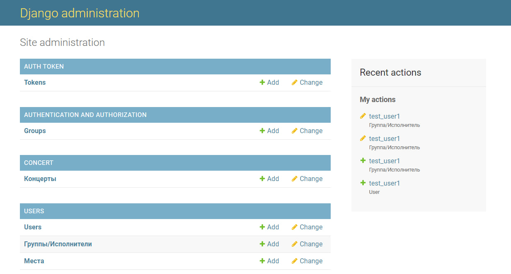
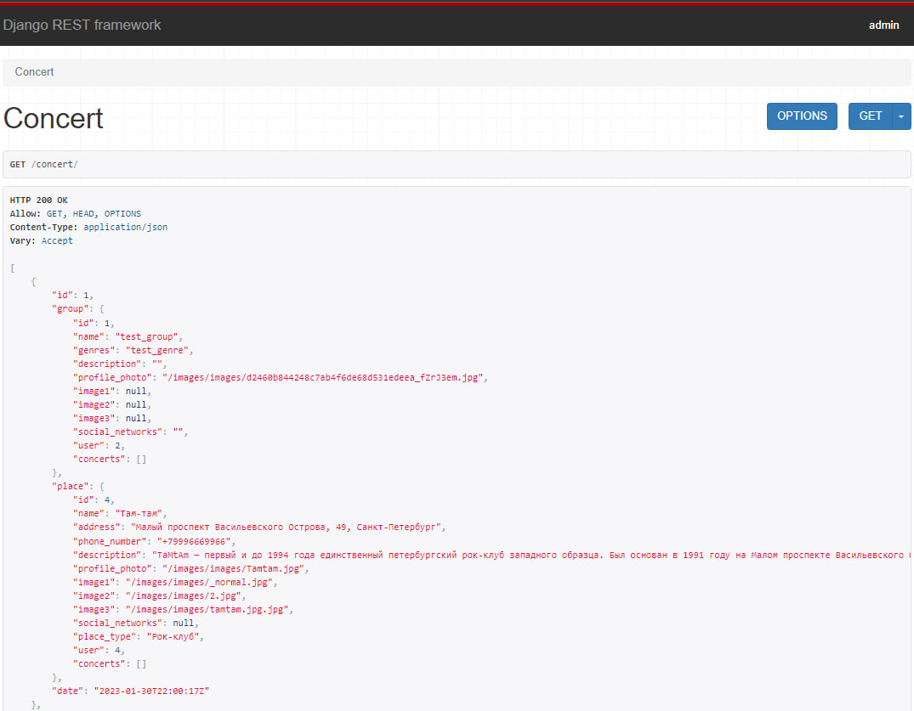
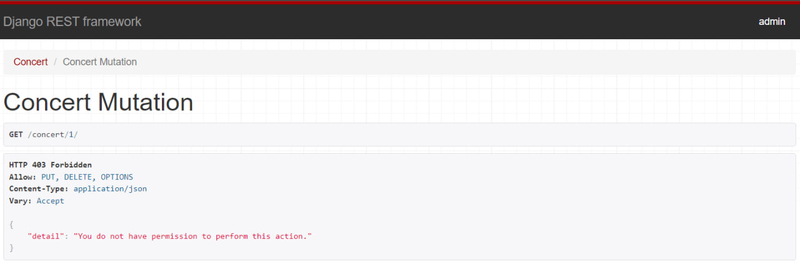

<h1 align="center">:metal: Rock-Con :metal:</h1>

:snake: It is an API for full-stack web project Rock-Con. It was implemented by Django REST framework and have <a href="https://github.com/vasiliy-poperekov/rock_con">frontend side</a>. This API deploys on PythonAnywhere free hosting. :snake:

## Overview

:computer: API has admin panel :computer:

:package: It implements CRUD requests :package:

:lock: Some requests blocked by JWT tokens :lock:

